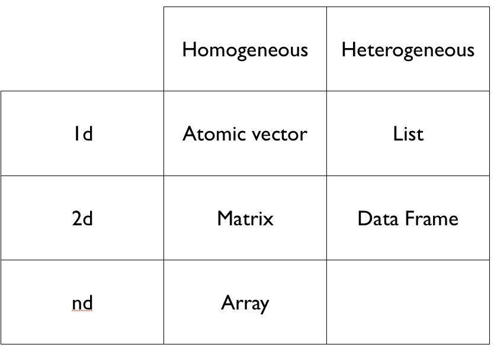

# Understanding basic data types in R

* To make the best of the R language, you'll need a strong understanding of the basic data types and data structures and how to operate on those.

* **Very Important** to understand because these are the objects you will manipulate on a day-to-day basis in R. Dealing with object conversions is one of the most common sources of frustration for beginners.

* Everything in `R` is an object. 

`R` has 6 (although we will not discuss the `raw` class for this workshop)  atomic classes.

* character
* numeric (real or decimal)
* integer
* logical
* complex

| Example | Type |
| ------- | ---- |
| "a", "swc" | character |
| 2, 15.5 | numeric | 
| 2 (Must add a `L` at end to denote integer) | integer |
| `TRUE`, `FALSE` | logical |
| 1+4i | complex | 


```r
typeof() # what is it?
length() # how long is it? What about two dimensional objects?
attributes() # does it have any metadata?

# Example

x <- "dataset"
typeof(x)
attributes(x)

y <- 1:10
typeof(y)
length(y)
attributes(y)

z <- c(1L, 2L, 3L)
typeof(z)
```


R has many data structures. These include

* atomic vector
* list
* matrix
* data frame
* factors
* tables


### Vectors
A vector is the most common and basic data structure in `R` and is pretty much the workhorse of R. Technically, vectors can be one of two types:

* atomic vectors
* lists

although the term "vector" most commonly refers to the atomic type not lists.

**Atomic Vectors**

A vector can be a vector of elements that are most commonly `character`, `logical`, `integer` or `numeric`.

You can create an empty vector with `vector()` (By default the mode is `logical`. You can be more explicit as shown in the examples below.) It is more common to use direct constructors such as `character()`, `numeric()`, etc.


```r
x <- vector()
# with a length and type
vector("character", length = 10)
```

```
##  [1] "" "" "" "" "" "" "" "" "" ""
```

```r
character(5) ## character vector of length 5
```

```
## [1] "" "" "" "" ""
```

```r
numeric(5)
```

```
## [1] 0 0 0 0 0
```

```r
logical(5)
```

```
## [1] FALSE FALSE FALSE FALSE FALSE
```


Various examples:


```r
x <- c(1, 2, 3)
x
```

```
## [1] 1 2 3
```

```r
length(x)
```

```
## [1] 3
```

`x` is a numeric vector. These are the most common kind. They are numeric objects and are treated as double precision real numbers. To explicitly create integers, add an `L` at the end.


```r
x1 <- c(1L, 2L, 3L)
```


You can also have logical vectors. 


```r
y <- c(TRUE, TRUE, FALSE, FALSE)
```


Finally you can have character vectors:


```r
z <- c("Alec", "Dan", "Rob", "Karthik")
```


**Examine your vector**  


```r
typeof(z)
```

```
## [1] "character"
```

```r
length(z)
```

```
## [1] 4
```

```r
class(z)
```

```
## [1] "character"
```

```r
str(z)
```

```
##  chr [1:4] "Alec" "Dan" "Rob" "Karthik"
```


Question: Do you see a property that's common to all these vectors above?

**Add elements**


```r
z <- c(z, "Annette")
z
```

```
## [1] "Alec"    "Dan"     "Rob"     "Karthik" "Annette"
```


More examples of vectors


```r
x <- c(0.5, 0.7)
x <- c(TRUE, FALSE)
x <- c("a", "b", "c", "d", "e")
x <- 9:100
x <- c(1+0i, 2+4i)
```


You can also create vectors as a sequence of numbers


```r
series <- 1:10
seq(10)
```

```
##  [1]  1  2  3  4  5  6  7  8  9 10
```

```r
seq(1, 10, by = 0.1)
```

```
##  [1]  1.0  1.1  1.2  1.3  1.4  1.5  1.6  1.7  1.8  1.9  2.0  2.1  2.2  2.3
## [15]  2.4  2.5  2.6  2.7  2.8  2.9  3.0  3.1  3.2  3.3  3.4  3.5  3.6  3.7
## [29]  3.8  3.9  4.0  4.1  4.2  4.3  4.4  4.5  4.6  4.7  4.8  4.9  5.0  5.1
## [43]  5.2  5.3  5.4  5.5  5.6  5.7  5.8  5.9  6.0  6.1  6.2  6.3  6.4  6.5
## [57]  6.6  6.7  6.8  6.9  7.0  7.1  7.2  7.3  7.4  7.5  7.6  7.7  7.8  7.9
## [71]  8.0  8.1  8.2  8.3  8.4  8.5  8.6  8.7  8.8  8.9  9.0  9.1  9.2  9.3
## [85]  9.4  9.5  9.6  9.7  9.8  9.9 10.0
```


**Other objects**

`Inf` is infinity. You can have either positive or negative infinity.


```r
1/0
```

```
## [1] Inf
```

```r
1/Inf
```

```
## [1] 0
```


`NaN` means Not a number. It's an undefined value.


```r
0/0
```

```
## [1] NaN
```


Each object can have attributes. Attribues can be part of an object of R. These include: 

* names
* dimnames
* dim
* class
* attributes (contain metadata)

You can also glean other attribute-like information such as length (works on vectors and lists) or number of characters (for character strings). 


```r
length(1:10)
```

```
## [1] 10
```

```r
nchar("Software Carpentry")
```

```
## [1] 18
```


**What happens when you mix types?**

R will create a resulting vector that is the least common denominator. The coercion will move towards the one that's easiest to coerce to.

**Guess what the following do without running them first**


```r
xx <- c(1.7, "a") 
xx <- c(TRUE, 2) 
xx <- c("a", TRUE) 
```


This is called implicit coercion.  You can also coerce vectors explicitly using the `as.<class_name>`. Example


```r
as.numeric()
as.character()
```


When you coerce an existing numeric vector with `as.numeric()`, it converts the vector to a double.


```r
x <- 0:6
identical(x, as.numeric(x))
```

```
## [1] FALSE
```

```r
typeof(x)
```

```
## [1] "integer"
```

```r
typeof(as.numeric(x))
```

```
## [1] "double"
```


```r
x <- 0:6
as.numeric(x)
```

```
## [1] 0 1 2 3 4 5 6
```

```r
as.logical(x) 
```

```
## [1] FALSE  TRUE  TRUE  TRUE  TRUE  TRUE  TRUE
```

```r
as.character(x)
```

```
## [1] "0" "1" "2" "3" "4" "5" "6"
```

```r
as.complex(x) 
```

```
## [1] 0+0i 1+0i 2+0i 3+0i 4+0i 5+0i 6+0i
```


Sometimes coercions, especially nonsensical ones, won’t work.


```r
x <- c("a", "b", "c")
as.numeric(x)
```

```
## Warning: NAs introduced by coercion
```

```
## [1] NA NA NA
```

```r
as.logical(x)
```

```
## [1] NA NA NA
```

```r
# both don't work
```


**Sometimes there is implicit conversion**


```r
1 < "2"
```

```
## [1] TRUE
```

```r
"1" > 2
```

```
## [1] FALSE
```


## Matrix

Matrices are a special vector in R. They are not a separate type of object but simply an atomic vector with dimensions added on to it. Matrices have rows and columns. 


```r
m <- matrix(nrow = 2, ncol = 2)
m
```

```
##      [,1] [,2]
## [1,]   NA   NA
## [2,]   NA   NA
```

```r
dim(m)
```

```
## [1] 2 2
```


Matrices are filled column-wise. 


```r
m <- matrix(1:6, nrow = 2, ncol = 3)
```


Other ways to construct a matrix


```r
m <- 1:10
dim(m) <- c(2, 5)
```


This takes a vector and transform into a matrix with 2 rows and 5 columns.


Another way is to bind columns or rows using `cbind()` and `rbind()`.


```r
x <- 1:3
y <- 10:12
cbind(x, y)
```

```
##      x  y
## [1,] 1 10
## [2,] 2 11
## [3,] 3 12
```

```r
# or 
rbind(x, y)
```

```
##   [,1] [,2] [,3]
## x    1    2    3
## y   10   11   12
```


You can also use the `byrow` argument to specify how the matrix is filled. From R's own documentation:


```r
mdat <- matrix(c(1,2,3, 11,12,13), nrow = 2, ncol = 3, byrow = TRUE,
               dimnames = list(c("row1", "row2"),
                               c("C.1", "C.2", "C.3")))
mdat
```

```
##      C.1 C.2 C.3
## row1   1   2   3
## row2  11  12  13
```


---

## List

In R lists act as containers. Unlike atomic vectors, the contents of a list are not restricted to a single mode and can encompass any mixture of data types. Lists are sometimes called recursive vectors, because a list can contain other lists. This makes them fundamentally different from atomic vectors. 

A list is a special type of vector. Each element can be a different type.


Create lists using `list()` or coerce other objects using `as.list()`


```r
x <- list(1, "a", TRUE, 1+4i)
x
```

```
## [[1]]
## [1] 1
## 
## [[2]]
## [1] "a"
## 
## [[3]]
## [1] TRUE
## 
## [[4]]
## [1] 1+4i
```


```r
x <- 1:10
x <- as.list(x)
length(x)
```

```
## [1] 10
```


What is the class of `x[1]`?  
How about `x[[1]]`?


```r
xlist <- list(a = "Karthik Ram", b = 1:10, data = head(iris))
xlist
```

```
## $a
## [1] "Karthik Ram"
## 
## $b
##  [1]  1  2  3  4  5  6  7  8  9 10
## 
## $data
##   Sepal.Length Sepal.Width Petal.Length Petal.Width Species
## 1          5.1         3.5          1.4         0.2  setosa
## 2          4.9         3.0          1.4         0.2  setosa
## 3          4.7         3.2          1.3         0.2  setosa
## 4          4.6         3.1          1.5         0.2  setosa
## 5          5.0         3.6          1.4         0.2  setosa
## 6          5.4         3.9          1.7         0.4  setosa
```


What is the length of this object?
What about its structure?

A list can contain many lists nested inside.


```r
temp <- list(list(list(list())))
temp
```

```
## [[1]]
## [[1]][[1]]
## [[1]][[1]][[1]]
## list()
```

```r
is.recursive(temp)
```

```
## [1] TRUE
```


Lists are extremely useful inside functions. You can "staple" together lots of different kinds of results into a single object that a function can return.

A list does not print to the console like a vector. Instead, each element of the list starts on a new line.

Elements are indexed by double brackets. Single brackets will still return a(nother) list.

---

## Factors

Factors are special vectors that represent categorical data. Factors can be ordered or unordered and are important when for modelling functions such as `lm()` and `glm()` and also in plot methods.

Factors can only contain pre-defined values.

Factors are pretty much integers that have labels on them.  While factors look (and often behave) like character vectors, they are actually integers under the hood, and you need to be careful when treating them like strings. Some string methods will coerce factors to strings, while others will throw an error.

Sometimes factors can be left unordered. Example: `male`, `female`.

Other times you might want factors to be ordered (or ranked). Example: `low`, `medium`, `high`. 

Underlying it's represented by numbers 1, 2, 3.

They are better than using simple integer labels because factors are what are called self describing. `male` and `female` is more descriptive than `1`s and `2`s. Helpful when there is no additional metadata.

Which is `male`? `1` or `2`? You wouldn't be able to tell with just integer data. Factors have this information built in.

Factors can be created with `factor()`. Input is generally a character vector.


```r
x <- factor(c("yes", "no", "no", "yes", "yes"))
x
```

```
## [1] yes no  no  yes yes
## Levels: no yes
```


`table(x)` will return a frequency table.

If you need to convert a factor to a character vector, simply use


```r
as.character(x)
```

```
## [1] "yes" "no"  "no"  "yes" "yes"
```


In modeling functions, it is important to know what the baseline level is.
This is the first factor but by default the ordering is determined by alphabetical order of words entered. You can change this by speciying the levels (another option is to use the function `relevel`).


```r
x <- factor(c("yes", "no", "yes"), levels = c("yes", "no"))
x
```

```
## [1] yes no  yes
## Levels: yes no
```


## Data frame

A data frame is a very important data type in R. It's pretty much the *de facto* data structure for most tabular data and what we use for statistics.

Data frames can have additional attributes such as `rownames()`, which can be useful for annotating data, like subject_id or sample_id. But most of the time they are not used.

Some additional information on data frames:

* Usually created by `read.csv()` and `read.table()`.

* Can convert to `matrix` with `data.matrix()`

* Coercion will be forced and not always what you expect.

* Can also create with `data.frame()` function.

* Find the number of rows and columns with `nrow(df)` and `ncol(df)`, respectively.

* Rownames are usually 1..n.

**Combining data frames**


```r
df <- data.frame(id = letters[1:10], x = 1:10, y = rnorm(10))
df
```

```
##    id  x        y
## 1   a  1  0.01903
## 2   b  2 -0.64804
## 3   c  3 -0.40189
## 4   d  4 -2.05006
## 5   e  5 -0.60957
## 6   f  6  0.74551
## 7   g  7  0.61598
## 8   h  8 -0.46288
## 9   i  9  0.06566
## 10  j 10  0.30031
```

```r
cbind(df, data.frame(z = 4))
```

```
##    id  x        y z
## 1   a  1  0.01903 4
## 2   b  2 -0.64804 4
## 3   c  3 -0.40189 4
## 4   d  4 -2.05006 4
## 5   e  5 -0.60957 4
## 6   f  6  0.74551 4
## 7   g  7  0.61598 4
## 8   h  8 -0.46288 4
## 9   i  9  0.06566 4
## 10  j 10  0.30031 4
```


When you combine column wise, only row numbers need to match. If you are adding a vector, it will get repeated.

**Useful functions**  
* `head()` - see first 6 rows
* `tail()` - see last 6 rows
* `dim()` - see dimensions
* `nrow()` - number of rows
* `ncol()` - number of columns
* `str()` - structure of each column
* `names()` - will list the `names` attribute for a data frame (or any object really), which gives the column names.

A data frame is a special type of list where every element of the list has same length.

See that it is actually a special list:


```r
is.list(iris)
```

```
## [1] TRUE
```

```r
class(iris)
```

```
## [1] "data.frame"
```


**Naming objects**

Other R objects can also have names. Adding names is helpful since it's useful for readable code and self describing objects.


```r
x <- 1:3
names(x) <- c("karthik", "ram", "rocks")
x
```

```
## karthik     ram   rocks 
##       1       2       3
```


Lists can also have names.


```r
x <- as.list(1:10)
names(x) <- letters[seq(along = x)]
x
```

```
## $a
## [1] 1
## 
## $b
## [1] 2
## 
## $c
## [1] 3
## 
## $d
## [1] 4
## 
## $e
## [1] 5
## 
## $f
## [1] 6
## 
## $g
## [1] 7
## 
## $h
## [1] 8
## 
## $i
## [1] 9
## 
## $j
## [1] 10
```


Finally matrices can have names and these are called `dimnames`


```r
m <- matrix(1:4, nrow = 2)
dimnames(m) <- list(c("a", "b"), c("c", "d"))
# first element = rownames
# second element = colnames
m
```

```
##   c d
## a 1 3
## b 2 4
```

```r
dimnames(m)
```

```
## [[1]]
## [1] "a" "b"
## 
## [[2]]
## [1] "c" "d"
```

```r
colnames(m) ## or rownames(m)
```

```
## [1] "c" "d"
```


---


## Missing values

Denoted by `NA` and/or `NaN` for undefined mathematical operations.


```r
is.na()
is.nan()
```


check for both.

NA values have a class. So you can have both an integer NA (`NA_integer_`) and a character NA (`NA_character_`).

`NaN` is also `NA`. But not the other way around.


```r
x <- c(1,2, NA, 4, 5)
x
```

```
## [1]  1  2 NA  4  5
```


```r
is.na(x) # returns logical
```

```
## [1] FALSE FALSE  TRUE FALSE FALSE
```

```r
# shows third
is.nan(x)
```

```
## [1] FALSE FALSE FALSE FALSE FALSE
```

```r
# none are NaN
```


```r
x <- c(1,2, NA, NaN, 4, 5)
is.na(x)
```

```
## [1] FALSE FALSE  TRUE  TRUE FALSE FALSE
```

```r
# shows 2 TRUE
is.nan(x)
```

```
## [1] FALSE FALSE FALSE  TRUE FALSE FALSE
```

```r
# shows 1 TRUE
```


---

# Review of R data types




