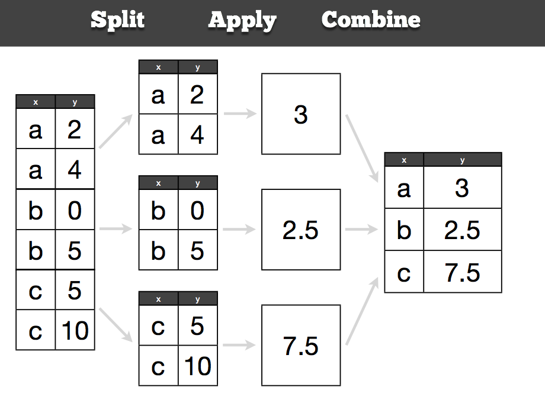

```{r, include = FALSE}
source("../chunk_options.R")
```

# Using the split-apply strategy to manipulate data

Groupwise operations - The plyr package provides an elegant way to extract complicated information from any data set. Most data manipulation tasks can be reduced to a core set of actions. plyr provides an easy to learn interface for these actions. We’ll show you how to mine a data set for its hidden gems, with plyr’s’ consistent, purposefully-designed workflow. In this module, you will

> Learn the four basic verbs of data manipulation: 

* `subset`
* `summarise`
* `arrange`
*  split-apply strategies

By aster the split-apply-combine strategy and use it to solve complicated data manipulation problems.

# The split-apply strategy



The core idea behind this strategy is to split up the original data (this can be any format includng data.frames, lists, arrays, matrics, vectors), apply existing or custom functions to it, and reassemble the results in the same or different format.


Let's create a small dataset to work with:

```
sdf <- data.frame(color = c("blue", "black", "blue", "blue", "black"), value = 1:5)
```

A simple way to subset would be:

sdf[sdf$color == "blue", ]

we can perform operations on these. But when you have many groups to subset, you will end up writing a lot of lines of code. With `plyr`, you can do this much more easily.

__Note__: With plyr, in functions `*ply` you can reference a column name by doing `.(column)` or `"column"` - just to help you not get confused if you see both.

```
ddply(sdf, .(color), summarise, largest=max(value))
# or 
# ddply(sdf, "color", summarise, largest = max(value))
#   color largest
# 1 black       5
# 2  blue       4
```


```
ddply(sdf, .(color), transform, z = value/max(value)*100)
#   color value   z
# 1 black     2  40
# 2 black     5 100
# 3  blue     1  25
# 4  blue     3  75
# 5  blue     4 100
```

## Arrange 

Helps you reorder data based on one or more columns. With the above example:

```
arrange(sdf, color)
#   color value
# 1 black     2
# 2 black     5
# 3  blue     1
# 4  blue     3
# 5  blue     4
```

You can also run transformation on the data quite efficiently using mutate

```
mutate(sdf, double = value * 2)
```

# Summarizing the iris dataset

```coffee
ddply(iris, .(Species), summarise, mean_sepal = mean(Sepal.Length))
#     Species mean_sepal
# 1     setosa      5.006
# 2 versicolor      5.936
# 3  virginica      6.588
```


---

## More on groupwise transformations

Let's read a large dataset of baby names from the social security administration.

```
library(plyr)
options(stringsAsFactors = FALSE)
```

```coffee
# Can read compressed files directly
bnames <- read.csv("data/baby-names2.csv.bz2")
```

Extract your name from this dataset (if it's there)

```
karthik <- subset(bnames, name == "karthik")
# my name is a little too uncommon in this dataset. Try Annette, Rob, Dan etc.
```

 **What if we want to compute the rank of a name
  within a sex and year? 
  This task is easy if we have a single year & sex:**

```
one <- subset(bnames, sex == "boy" & year == 2008)
one <- mutate(one,
  rank = rank(desc(prop), ties.method = "min"))
head(one)
```

# What if we want to transform for every sex and year?

```
bnames <- ddply(bnames, c("sex", "year"), mutate,
  rank = rank(desc(prop), ties.method = "min"))
head(bnames)
```


__Exercise__: play with one of the *ply functions we haven't' used yet e..g., 

* dlply to go from a data.frame to a list
* ldply to go froma list to a data.frame


## reshape2 - melt - cast - recast, etc.

Load `reshape2`

```{r}
library(reshape2)
```

Melt - melting a data.frame turns it from wide to long.

```{r}
names(airquality) <- tolower(names(airquality))
head(airquality)
aqm <- melt(airquality, id=c("month", "day"), na.rm=TRUE)
head(aqm)
```

A melted dataset can then be manipulated back to wide format, with manipulations along the way.

```{r}
df <- dcast(aqm, month ~ variable, mean)
df
```

Or a bit more complicated

```{r}
df <- dcast(aqm, month ~ variable, mean, margins = c("month", "variable"))
df
```

Notice the perhaps familiar formula interface to manipulate a `data.frame` that you've likely used in `lm` for example.

You'll find this useful when you use ggplot2 to make visualizations. 


__Exercise__: 

1. Using the `iris`... With `Species` as the indicator variable, convert the wide dataset to long such that it appears as below:

```
  Species     variable value
1  setosa Sepal.Length   5.1
2  setosa Sepal.Length   4.9
3  setosa Sepal.Length   4.7
4  setosa Sepal.Length   4.6
5  setosa Sepal.Length   5.0
6  setosa Sepal.Length   5.4
```

2.  Save this dataset to disk as `"species1.csv"`. Duplicate the previous function call and save it again as `"species2.csv"``

Write code that does the following:

Create a list of length two containing "species1.csv" and "species2.csv". 
Now write a `lapply` function to read both csv files using write.csv into a list.