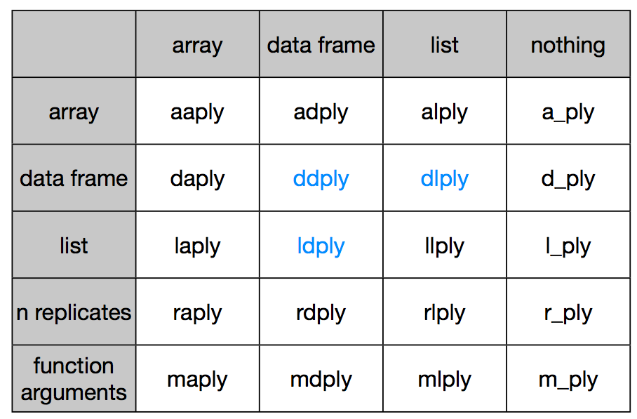

# Using the split-apply strategy to manipulate data

Groupwise operations - The plyr package provides an elegant way to extract complicated information from any data set. Most data manipulation tasks can be reduced to a core set of actions. plyr provides an easy to learn interface for these actions. We’ll show you how to mine a data set for its hidden gems, with plyr’s’ consistent, purposefully-designed workflow. In this module, you will

> Learn the four basic verbs of data manipulation: 

* `subset`
* `summarise`
* `arrange`
*  split-apply strategies

By aster the split-apply-combine strategy and use it to solve complicated data manipulation problems.

# The split-apply strategy


The core idea behind this strategy is to split up the original data (this can be any format includng data.frames, lists, arrays, matrics, vectors), apply existing or custom functions to it, and reassemble the results in the same or different format.


Let's create a small dataset to work with:

```
sdf <- data.frame(color = c("blue", "black", "blue", "blue", "black"), value = 1:5)
```

A simple way to subset would be:

sdf[sdf$color == "blue", ]

we can perform operations on these. But when you have many groups to subset, you will end up writing a lot of lines of code. With `plyr`, you can do this much more easily.

```
ddply(sdf, .(color), summarise, largest=max(value))
# or 
# ddply(sdf, "color", summarise, largest = max(value))
#   color largest
# 1 black       5
# 2  blue       4
```


```
ddply(sdf, .(color), transform, z = value/max(value)*100)
#   color value   z
# 1 black     2  40
# 2 black     5 100
# 3  blue     1  25
# 4  blue     3  75
# 5  blue     4 100
```

## Arrange 

Helps you reorder data based on one or more columns. With the above example:

```
arrange(sdf, color)
#   color value
# 1 black     2
# 2 black     5
# 3  blue     1
# 4  blue     3
# 5  blue     4
```

You can also run transformation on the data quite efficiently using mutate

```
mutate(df, double = length * 10)
```

---

## More on groupwise transformations

Let's read a large dataset of baby names from the social security administration.

```
library(plyr)
library(ggplot2)
options(stringsAsFactors = FALSE)
```

# Summarizing the iris dataset

```coffee
ddply(iris, .(Species), summarise, mean_sepal = mean(Sepal.Length))
#     Species mean_sepal
# 1     setosa      5.006
# 2 versicolor      5.936
# 3  virginica      6.588
```


```coffee
options(stringsAsFactors = FALSE)
# Can read compressed files directly
bnames <- read.csv("data/baby-names2.csv.bz2")
```

Extract your name from this dataset (if it's there)

```
karthik <- subset(bnames, name == "karthik")
# my name is a little too uncommon in this dataset. Try Annette, Rob, Dan etc.
```

 **What if we want to compute the rank of a name
  within a sex and year? 
  This task is easy if we have a single year & sex:**

```
one <- subset(bnames, sex == "boy" & year == 2008)
one <- mutate(one,
  rank = rank(desc(prop), ties.method = "min"))
head(one)
```

# What if we want to transform for every sex and year?

```
bnames <- ddply(bnames, c("sex", "year"), mutate,
  rank = rank(desc(prop), ties.method = "min"))
head(bnames)
```




## reshape2 - melt - cast - recast, etc.

Load `reshape2`


```r
library(reshape2)
```


Melt - melting a data.frame turns it from wide to long.


```r
names(airquality) <- tolower(names(airquality))
head(airquality)
```

```
##   ozone solar.r wind temp month day
## 1    41     190  7.4   67     5   1
## 2    36     118  8.0   72     5   2
## 3    12     149 12.6   74     5   3
## 4    18     313 11.5   62     5   4
## 5    NA      NA 14.3   56     5   5
## 6    28      NA 14.9   66     5   6
```

```r
aqm <- melt(airquality, id=c("month", "day"), na.rm=TRUE)
head(aqm)
```

```
##   month day variable value
## 1     5   1    ozone    41
## 2     5   2    ozone    36
## 3     5   3    ozone    12
## 4     5   4    ozone    18
## 6     5   6    ozone    28
## 7     5   7    ozone    23
```


A melted dataset can then be manipulated back to wide format, with manipulations along the way.


```r
df <- dcast(aqm, month ~ variable, mean, margins = c("month", "variable"))
df
```

```
##   month ozone solar.r   wind  temp (all)
## 1     5 23.62   181.3 11.623 65.55 68.71
## 2     6 29.44   190.2 10.267 79.10 87.38
## 3     7 59.12   216.5  8.942 83.90 93.50
## 4     8 59.96   171.9  8.794 83.97 79.71
## 5     9 31.45   167.4 10.180 76.90 71.83
## 6 (all) 42.13   185.9  9.958 77.88 80.06
```


Notice the perhaps familiar formula interface to manipulate a data.frame that you've likely used in `lm` for example.

You'll find this useful when you use ggplot2 to make visualizations. 
